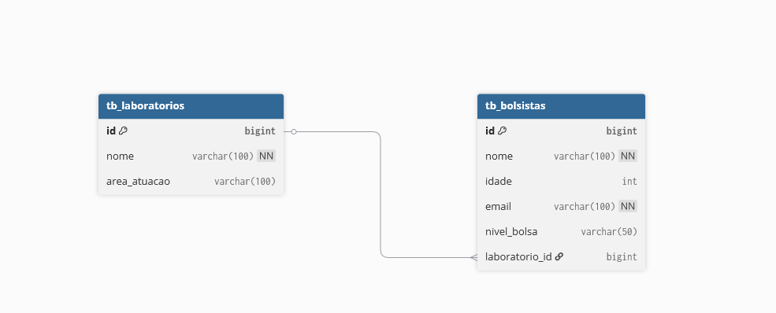

# Cadastro de Bolsistas

Sistema de cadastro de bolsistas acadêmicos organizado em camadas, desenvolvido com Spring Boot. Esta aplicação oferece API REST para gerenciamento de bolsistas e laboratórios e uma interface web simples (Thymeleaf) para operações CRUD.

## Menu

- [Sobre o projeto](#sobre-o-projeto)
- [Arquitetura](#arquitetura)
- [Diagrama](#diagrama)
- [Tecnologias](#tecnologias)
- [Configuração](#configuração)
- [Passo a passo](#passo-a-passo)
- [Docker / Docker Compose](#docker--docker-compose)
- [Padrões do projeto](#padr%C3%B5es-do-projeto)
- [Endpoints REST](#endpoints-rest)
- [Rotas UI (Thymeleaf)](#rotas-ui-thymeleaf)
- [Exemplos rápidos de uso](#exemplos-r%C3%A1pidos-de-uso)

## Sobre o projeto

`CadastroDeBolsistas` é um sistema para gerenciar bolsistas e laboratórios acadêmicos. Possui:
- API REST para operações CRUD de bolsistas e laboratórios.
- Interface web (Thymeleaf) para listar, criar, editar, visualizar e excluir registros.
- Migrações de banco com Flyway para criar as tabelas iniciais.
- Documentação via OpenAPI/Swagger.

## Arquitetura

O projeto segue uma arquitetura por camadas com organização de pacotes em `src/main/java/dev/matheus/CadastroDeBolsistas/`:

- `Bolsistas/` — controllers, DTOs, mappers, models, repositories, services
- `Laboratorios/` — controllers, DTOs, mappers, models, repositories, services
- `Config/` — configurações da aplicação (ex.: Swagger)
- `Exceptions/` — tratamento centralizado de erros
- `resources/templates/` — templates Thymeleaf (UI)

## Diagrama

Uma imagem com o diagrama da arquitetura/fluxo do sistema está incluída no repositório em `images/diagram.png`.



## Tecnologias

    


## Configuração

Os valores padrão usados no projeto (definidos em `src/main/resources/application.yaml`):

- Banco (PostgreSQL):
  - url: `jdbc:postgresql://localhost:5432/cadastroDeBolsistas`
  - username: `postgres`
  - password: `postgres`

- Swagger / OpenAPI:
  - OpenAPI JSON: `/api/api-docs`
  - Swagger UI: `/swagger/index.html`

- Flyway: habilitado (migrations em `resources/db/migration`)

Ajuste as configurações conforme o seu ambiente (variáveis de ambiente, profiles ou `application.yaml`).

## Passo a passo

1. Clone o repositório:

```bash
git clone [url-do-repositorio]
cd CadastroDeBolsistas
```

2. Configure o PostgreSQL local conforme as credenciais acima ou atualize `application.yaml`.

3. Build do projeto (Windows / Unix):

```bash
# Unix / Git Bash
./mvnw clean package

# Windows (PowerShell/CMD)
./mvnw.cmd clean package
```

4. Rodar a aplicação:

```bash
# Usando Maven
./mvnw spring-boot:run

# Ou executar o JAR (após build)
java -jar target/*.jar
```

A aplicação estará disponível em `http://localhost:8080` por padrão.

## Docker / Docker Compose

Este projeto inclui um arquivo `docker-compose.yml` na raiz do repositório que pode ser usado para levantar dependências (ex.: PostgreSQL) e/ou o próprio serviço da aplicação, dependendo da configuração do arquivo.

Passos rápidos usando Docker Compose:

```bash
# Subir os serviços definidos no docker-compose (build quando necessário)
docker-compose up -d --build

# Ver logs
docker-compose logs -f

# Parar e remover containers
docker-compose down
```

## Padrões do projeto

- Banco de dados: PostgreSQL (host: localhost, port: 5432, database: cadastroDeBolsistas)
- Migrações: Flyway (scripts em `src/main/resources/db/migration`)
- Swagger: `/swagger/index.html` (UI) e `/api/api-docs` (JSON)
- Templates Thymeleaf: `src/main/resources/templates` (UI para bolsistas e laboratórios)

## Endpoints REST

Base: `/api`

Bolsistas
- GET `/api/bolsistas` — listar todos os bolsistas
- GET `/api/bolsistas/{id}` — obter bolsista por id
- POST `/api/bolsistas` — criar novo bolsista
- PATCH `/api/bolsistas/{id}` — atualizar parcialmente um bolsista
- DELETE `/api/bolsistas/{id}` — deletar um bolsista

Laboratórios
- GET `/api/laboratorios` — listar todos os laboratórios
- GET `/api/laboratorios/{id}` — obter laboratório por id
- POST `/api/laboratorios` — criar novo laboratório
- PATCH `/api/laboratorios/{id}` — atualizar parcialmente um laboratório
- DELETE `/api/laboratorios/{id}` — deletar um laboratório (falhará se houver bolsistas vinculados)

## Rotas UI (Thymeleaf)

A aplicação também fornece páginas server-side (Thymeleaf) para operações CRUD:

Bolsistas (UI)
- GET `/bolsistas/ui/listar` — lista todos os bolsistas
- GET `/bolsistas/ui/adicionar` — formulário para adicionar
- POST `/bolsistas/ui/salvar` — salvar novo bolsista
- GET `/bolsistas/ui/editar/{id}` — formulário de edição
- POST `/bolsistas/ui/atualizar/{id}` — atualizar bolsista
- GET `/bolsistas/ui/visualizar/{id}` — visualizar detalhes
- GET `/bolsistas/ui/excluir/{id}` — confirmar exclusão
- POST `/bolsistas/ui/deletar/{id}` — deletar bolsista

Laboratórios (UI)
- GET `/laboratorios/ui/listar` — lista todos os laboratórios
- GET `/laboratorios/ui/adicionar` — formulário para adicionar
- POST `/laboratorios/ui/salvar` — salvar novo laboratório
- GET `/laboratorios/ui/editar/{id}` — formulário de edição
- POST `/laboratorios/ui/atualizar/{id}` — atualizar laboratório
- GET `/laboratorios/ui/visualizar/{id}` — visualizar detalhes (inclui lista de bolsistas)
- GET `/laboratorios/ui/excluir/{id}` — confirmar exclusão
- POST `/laboratorios/ui/deletar/{id}` — deletar laboratório

## Exemplos rápidos de uso (REST)

Listar bolsistas:

```bash
curl -s http://localhost:8080/api/bolsistas | jq '.'
```

Criar bolsista (exemplo):

```bash
curl -X POST http://localhost:8080/api/bolsistas \
  -H "Content-Type: application/json" \
  -d '{ "nome":"João Silva", "idade":25, "email":"joao@ufsm.edu.br", "nivelBolsa":"BOLSA_NIVEL_1", "laboratorio": { "id": 1 } }'
```

Atualizar (PATCH):

```bash
curl -X PATCH http://localhost:8080/api/bolsistas/1 \
  -H "Content-Type: application/json" \
  -d '{ "idade": 26 }'
```

Deletar:

```bash
curl -X DELETE http://localhost:8080/api/bolsistas/1
```

